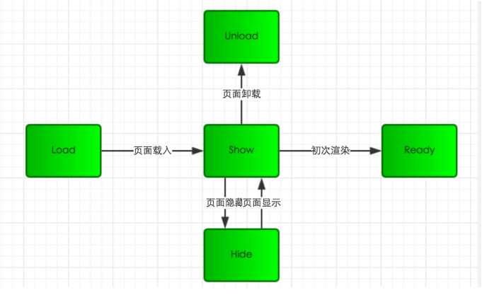

# 微信小程序

### 页面

#### 微信新页面的创建方式有3种

1. app.json文件开始创建
2. 单个文逐一创建
3. 删除文件后的编译自动创建

#### 新页面创建的层次关系

1. 所有页面都在pages文件中，也可以自行自定义的其他文件，比如page
2. 在一个文件夹中创建一个页面（创建简单、代码清晰）
3. 在一个文件夹中创建多个页面（层次清晰）

#### 页面结构文件介绍
WXML:(WeiXin Markup Language）是框架设计的一套标签语言，结合基础组件、事件系统，可以构建出页面的结构，【与网页相对应的是HTML文件】。
WXSS：(WeiXin Style Sheets)是一套样式语言，用于描述 WXML 的组件样式，【与网页相对应的是CSS文件】。
JS:小程序开发框架的逻辑层使用 JavaScript 引擎为小程序提供开发者 JavaScript 代码的运行环境以及微信小程序的特有功能。【与网页相对应的是JavaScript文件】。
JSON：每一个小程序页面也可以使用同名 .json 文件来对本页面的窗口表现进行配置，页面中配置项会覆盖 app.json 的 window 中相同的配置项，【Javascript（json对象）】。
APP文件名：用来对微信小程序进行全局配置（application）。

**编码要求**
* 不能直接使用HTML文件
* 可以全部使用CSS文件
* Js脚本文件没有Window对象

### 生命周期

参考文档
[【小程序】生命周期](https://www.cnblogs.com/lilicat/p/10456481.html)

小程序分为应用、页面和组件三个部分，所以小程序的生命周期涉及以下：
- 应用的生命周期
- 页面的生命周期
- 组件的声明周期
- 应用的生命周期对页面生命周期的影响

onLaunch:监听小程序初始化。小程序初始化完成时（全局只触发一次）
onLoad:生命周期函数—监听页面加载
onReady:生命周期函数-监听页面初次渲染
onShow:生命周期函数-监听页面显示
onHide:生命周期函数-监听页面隐藏
onUnload:生命周期函数-监听页面卸载
onPullDownRefresh:页面监听相关处理函数-监听用户下拉动作
onReachBottom:页面上拉触底事件的处理函数
onShareAppMessage:用户点击右上角分享

<!-- #### （1）应用的生命周期
`App()` 函数用来注册一个小程序。接受一个 `Object` 参数，其指定小程序的生命周期回调等。
`App()` 必须在 `app.js` 中调用，必须调用且只能调用一次。

```js
App({
  onLaunch: function(options) {
    // 监听小程序初始化。小程序初始化完成时（全局只触发一次）
  },
  onShow: function(options) {
    // 监听小程序显示。小程序启动，或从后台进入前台显示时
  },
  onHide: function() {
    // 监听小程序隐藏。小程序从前台进入后台时。
  },
  onError: function(msg) {
    console.log(msg) // 错误监听函数。小程序发生脚本错误，或者 api 调用失败时触发，会带上错误信息
  },
  onPageNotFound: function(res) {
    // 页面不存在监听函数。小程序要打开的页面不存在时触发，会带上页面信息回调该函数
  },
  globalData: 'I am global data'
})
```
**前台、后台定义**： 当用户点击左上角关闭，或者按了设备 Home 键离开微信，小程序并没有直接销毁，而是进入了后台；当再次进入微信或再次打开小程序，又会从后台进入前台。


> 页面生命周期


1. 用户首次打开小程序，触发 onLaunch 方法（全局只触发一次）。
2. 小程序初始化完成后，触发 onShow 方法，监听小程序显示。
3. 小程序从前台进入后台，触发 onHide 方法。
4. 小程序从后台进入前台显示，触发 onShow 方法。
5. 小程序后台运行一定时间，或系统资源占用过高，会被销毁。

全局的 `getApp()` 函数可以用来获取到小程序 `App` 实例。

```js
// other.js
var appInstance = getApp()
console.log(appInstance.globalData) // I am global data
```

**注意：** 
- 不要在定义于 App() 内的函数中调用 getApp() ，使用 this 就可以拿到 app 实例。
- 通过 getApp() 获取实例之后，不要私自调用生命周期函数。

#### （2）页面的生命周期

`Page(Object) `函数用来注册一个页面。接受一个 `Object` 类型参数，其指定页面的初始数据、生命周期回调、事件处理函数等。

```js
//index.js
Page({
  data: {
    // 页面的初始数据
    text: "This is page data."
  },
  onLoad: function(options) {
    // 生命周期回调—监听页面加载
  },
  onReady: function() {
    // 生命周期回调—监听页面初次渲染完成
  },
  onShow: function() {
    // 生命周期回调—监听页面显示
  },
  onHide: function() {
    // 生命周期回调—监听页面隐藏
  },
  onUnload: function() {
    // 生命周期回调—监听页面卸载
  },
  onPullDownRefresh: function() {
    // 监听用户下拉动作
  },
  onReachBottom: function() {
    // 页面上拉触底事件的处理函数
  },
  onShareAppMessage: function () {
    // 用户点击右上角转发
  },
  onPageScroll: function() {
    // 页面滚动触发事件的处理函数
  },
  onResize: function() {
    // 页面尺寸改变时触发
  },
  onTabItemTap(item) {
    // 当前是 tab 页时，点击 tab 时触发
    console.log(item.index)
    console.log(item.pagePath)
    console.log(item.text)
  },
  // 任意的函数，在页面的函数中用 this 可以访问
  viewTap: function() {
    this.setData({
      text: 'Set some data for updating view.'
    }, function() {
      // this is setData callback
    })
  },
  // 任意数据，在页面的函数中用 this 可以访问
  customData: {
    hi: 'MINA'
  }
})
```

>页面生命周期




- 小程序注册完成后，加载页面，触发onLoad方法。
- 页面载入后触发onShow方法，显示页面。
- 首次显示页面，会触发onReady方法，渲染页面元素和样式，一个页面只会调用一次。
- 当小程序后台运行或跳转到其他页面时，触发onHide方法。
- 当小程序有后台进入到前台运行或重新进入页面时，触发onShow方法。
- 当使用重定向方法wx.redirectTo(object)或关闭当前页返回上一页wx.navigateBack()，触发onUnload。

**总结**

- `onLoad`:   页面加载。一个页面只会调用一次。参数可以获取`wx.navigateTo`和`wx.redirectTo`及`<navigator/>`中的 `query`。
- `onShow`:   页面显示。每次打开页面都会调用一次。
- `onReady`:  页面初次渲染完成。一个页面只会调用一次，代表页面已经准备妥当，可以和视图层进行交互。对界面的设置如`wx.setNavigationBarTitle`请在`onReady`之后设置。
- `onHide`:   页面隐藏。当`navigateTo`或底部`tab`切换时调用。
- `onUnload`: 页面卸载。当`redirectTo`或`navigateBack`的时候调用。


 **Page 实例的生命周期**

 > 实例生命周期


小程序由两大线程组成：负责界面的视图线程（view thread）和负责数据、服务处理的服务线程（appservice thread），两者协同工作，完成小程序页面生命周期的调用。

视图线程有四大状态：

1. 初始化状态：初始化视图线程所需要的工作，初始化完成后向 “服务线程”发送初始化完成信号，然后进入等待状态，等待服务线程提供初始化数据。
2. 首次渲染状态：当收到服务线程提供的初始化数据后（json和js中的data数据），渲染小程序界面，渲染完毕后，发送“首次渲染完成信号”给服务线程，并将页面展示给用户。
3. 持续渲染状态：此时界面线程继续一直等待“服务线程”通过this.setdata（）函数发送来的界面数据，只要收到就重新局部渲染，也因此只要更新数据并发送信号，界面就自动更新。
4. 结束状态：页面被回收或者销毁、应用被系统回收、销毁时触发。

服务线程五大状态：

1. 初始化状态：此阶段仅启动服务线程所需的基本功能，比如信号发送模块。系统的初始化工作完毕，就调用自定义的onload和onshow，然后等待视图线程的“初始化完成”。onload是只会首次渲染的时候执行一次，onshow是每次界面切换都会执行。
2. 等待激活状态：接收到“视图线程初始化完成”信号后，将初始化数据发送给“视图线程”，等待视图线程完成初次渲染。
3. 激活状态：收到视图线程发送来的“首次渲染完成”信号后，就进入激活状态既程序的正常运行状态，并调用自定义的onReady()函数。此状态下就可以通过 this.setData 函数发送界面数据给界面线程进行局部渲染，更新页面。
4. 后台运行状态：如果界面进入后台，服务线程就进入后台运行状态，从目前的官方解读来说，这个状态挺奇怪的，和激活状态是相同的，也可以通过setdata函数更新界面的。毕竟小程序的框架刚推出，应该后续会有很大不同吧。
5. 结束状态：页面被回收或者销毁、应用被系统回收、销毁时触发。 -->

<!-- > 另： 写过react的童鞋都知道，react 中使用了 will、 did、should 等一系列有时态语义的词汇命名钩子函数。小程序中，统一使用on，那么on是在行为前还是行为后，从实例生命周期图中，我们可以明显看到：钩子触发执行时机都是在事件完成之后触发的。例如 `set to background` 之后 `onHode`。 -->

### 调试
* 逻辑代码调式方法
    * 控制台显示方式 console.log() console.info()
    * 弹出框（API框架时介绍）
* 模拟，真机调式模式
    * 点击编译，预览，真机调试

### 上线审核与发布
编译：对已有代码做保存、更新
预览：系统生成二维码，用手机微信扫码后可以在移动端看见
真机调试：同样生成二维码，在手机端可以查看运行，同时在PC端有调试结果
切后台：
清缓存：清除各种在运行期间所遗留下的缓存文件
版本管理：借助于git，完成对当前微信小程序版本的控制，可以做任何版本控制如推送，抓取等，同时也可以建立分支和合并分支
社区：互联网跳转链接，跳转到微信小程序论坛
测试号：互联网跳转链接，跳转微信开放文档-测试号申请页面
上传(APPID才有)：提供上传代码至微信开放平台

#### 小程序的发布步骤
1. 点击"上传"按钮，上传微信公众平台
**注意**：只有在正式APPID的情况下才有此按钮，测试环境是没有的
2. 打开微信公众平台点击"提交审核"
3. 三种状态
开发版本
审核版本
线上版本
同时也对应三种权限

### 组件

#### 基础组件
* ICON图标组件
  * type属性: icon类型 可以列举的属性值有success, success no circle, info, warn, waiting, cancel, download, clear
  * size属性：23默认值 单位像素
  * color属性：颜色设定

* text文本组件
* button
* input
* view
* swiper
* scroll-view

### 布局

#### 布局形式

### 数据绑定
WXML数据绑定：运用JS的data对象完成的WXML数据动态显示

绑定分类：基础绑定、组件绑定

### 条件渲染
wx:if用来做判断是否需要渲染

